# Getting started with nanoserve

nanoserve is a small LLM serving laboratory. It is deliberately not a
production server: its job is to make the mechanics of serving visible enough
that you can form a hypothesis, change one variable, measure the result, and
explain why it happened.

This guide takes you from a fake model to a real Qwen3-14B request, then shows
how every file and metric fits together.

> **The central idea:** inference makes a model produce tokens. Serving is the
> system that loads the model, accepts requests, streams tokens, measures the
> work, and eventually decides how competing requests share finite memory and
> compute.

## The whole system in one picture

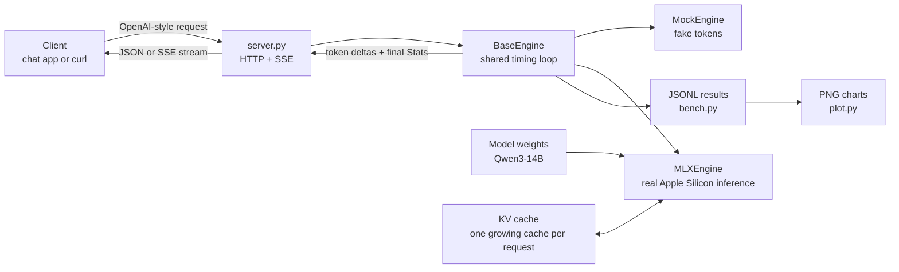

There are two paths through the repository:

- The **serving path** is `client -> server.py -> engine.py -> token stream`.
- The **experiment path** is `bench.py -> engine.py -> JSONL -> plot.py`.

Both paths use the same engine and timing code. That is what makes benchmark
results relevant to the server without hiding the mechanism behind a framework.

## A learning map of the files

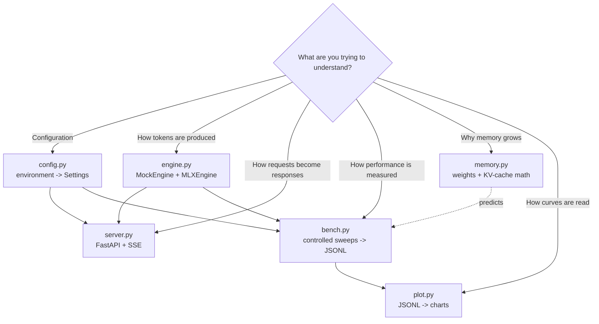

Read the files in this order:

1. `memory.py` — learn the two large consumers of memory.
2. `engine.py` — see prefill, decode, streaming, and measurement meet.
3. `bench.py` — see how controlled experiments are constructed.
4. `server.py` — see how inference becomes an HTTP service.
5. `config.py` and `plot.py` — see how runs are configured and interpreted.

Every file is short enough to read in one sitting. Reading the implementation
before running an experiment makes the resulting curve much more informative.

## Your first 15 minutes: run the entire stack with no model

The mock engine emits deterministic words with artificial delay. Its performance
numbers are fake; its value is proving that every pipe around inference works.

### 1. Create the environment

```bash
python3 -m venv .venv
source .venv/bin/activate
pip install -e ".[dev]"
python -m pytest -q
```

The tests use only `MockEngine`, so they do not need MLX or model weights.

### 2. Run a benchmark sweep

```bash
python -m nanoserve.bench --engine mock \
  --prompt-tokens 16 128 512 \
  --max-tokens 32 \
  --out results/mock.jsonl

python -m nanoserve.plot results/mock.jsonl --out results
```

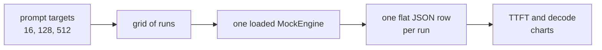

Open `results/mock.jsonl` before opening the charts. Each line is one
measurement, which keeps experiments inspectable, composable, and easy to load
with pandas, Polars, DuckDB, or plain Python.

Do not draw hardware conclusions from the mock curves. The fake engine sleeps
once per emitted word and does no prompt processing, so it is a plumbing test,
not a model benchmark.

### 3. Serve the mock model

In one terminal:

```bash
NANOSERVE_ENGINE=mock python -m nanoserve.server
```

In another terminal:

```bash
curl -N localhost:8000/v1/chat/completions \
  -H 'Content-Type: application/json' \
  -d '{
    "messages": [{"role": "user", "content": "Explain prefill simply."}],
    "max_tokens": 16,
    "temperature": 0,
    "stream": true
  }'
```

`-N` tells curl not to buffer the response. You should see multiple `data:`
events followed by `data: [DONE]`.

Then inspect what the server measured:

```bash
curl localhost:8000/health
curl localhost:8000/metrics
```

## What happens during one streaming request

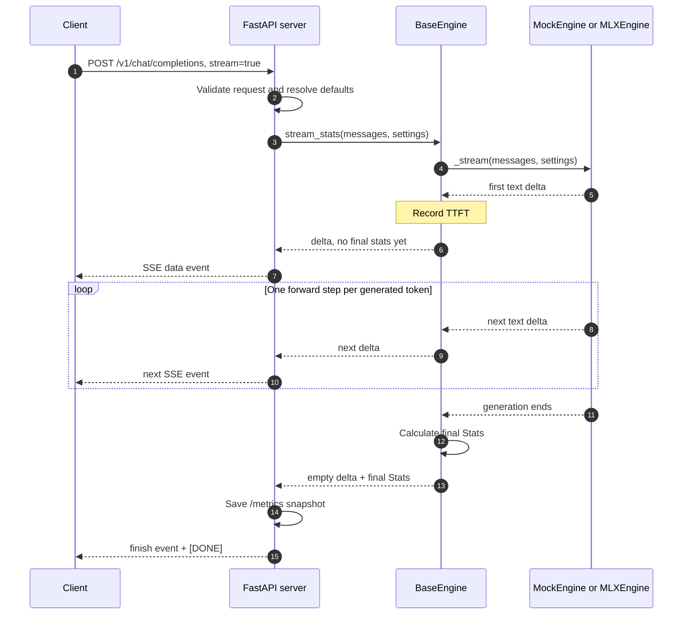

The server does not know how MLX generates a token. The MLX engine does not know
what HTTP or SSE is. `BaseEngine.stream_stats()` is the narrow seam between
them: subclasses produce pieces of text, while the base class owns common
timing and accounting.

### Streaming versus non-streaming

```mermaid
gantt
    title What the client experiences
    dateFormat X
    axisFormat %L ms
    section Non-streaming
    Prefill                 :0, 250
    Decode all tokens       :250, 1000
    Client sees response    :milestone, 1000, 0
    section Streaming
    Prefill                 :0, 250
    First token visible     :milestone, 250, 0
    Remaining tokens arrive :250, 1000
```

The model does almost the same work in both modes. Streaming improves perceived
latency because the client can use the first token while decode continues.

## The core model lifecycle: load, prefill, decode

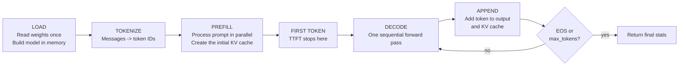

### Prefill

Prefill processes the prompt and creates the keys and values that attention will
reuse. Prompt tokens can be processed together, so prefill is relatively
parallel and often compute-bound.

In nanoserve:

```text
TTFT = request start -> first emitted token
prefill_tps = prompt_tokens / TTFT
```

`prefill_tps` is a useful approximation, not a pure kernel measurement: TTFT
also contains tokenization, Python overhead, and the first decode step.

### Decode

Decode is sequential. Token `n + 1` cannot be generated until token `n` is
known. Each step uses the shared weights and attends over the growing KV cache.

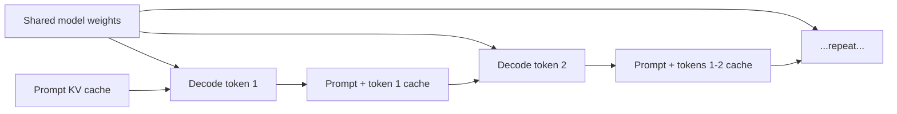

This is why decode often behaves like a memory-bandwidth problem on Apple
Silicon: every step touches a large, shared model and a cache that grows with
the sequence.

In nanoserve:

```text
decode_tps = (output_tokens - 1) / (total_time - TTFT)
```

The first generated token is excluded because its latency is already included
in TTFT.

## Memory: the picture to keep in your head

At inference time, model memory has two dominant terms:

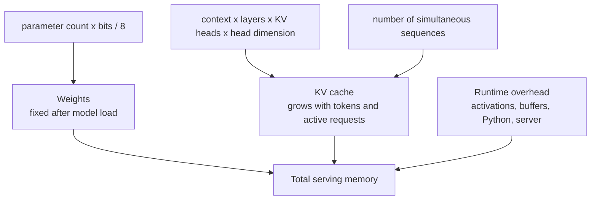

### Weight memory

```text
weight bytes = parameter count x bits per parameter / 8
```

For 14.8 billion parameters:

| Precision | Approximate weight memory | Intuition |
|---:|---:|---|
| BF16 | 27.6 GiB | High-precision baseline; little spare room |
| 8-bit | 13.8 GiB | Half the weight traffic of BF16 |
| 4-bit | 6.9 GiB | Much more room for contexts and requests |

Quantization can improve decode speed as well as fit. Fewer weight bytes means
less data must move during each sequential decode step.

### KV-cache memory

For a decoder transformer using grouped-query attention:

```text
KV bytes per token =
    2 x layers x KV heads x head dimension x bytes per KV value

total KV bytes = KV bytes per token x sequence length x active sequences
```

The first `2` represents keys and values. Qwen3-14B has 40 query heads but only
8 KV heads; this grouped-query attention geometry makes its KV cache much
smaller than a model with 40 KV heads.

Using nanoserve's current Qwen3-14B assumptions—40 layers, 8 KV heads,
128-dimensional heads, and 2-byte KV values—the cache costs 160 KiB per token:

| Context per request | KV cache for one request | Q4 weights + KV, before runtime overhead |
|---:|---:|---:|
| 2,048 | 0.31 GiB | 7.20 GiB |
| 8,192 | 1.25 GiB | 8.14 GiB |
| 32,768 | 5.00 GiB | 11.89 GiB |
| 40,960 | 6.25 GiB | 13.14 GiB |

These are feasibility estimates, not measured process memory. MLX buffers,
allocator caches, the server, and macOS need additional headroom.

Run the calculator before a large download or context sweep:

```bash
python -m nanoserve.memory \
  --params 14.8 \
  --bits 4 \
  --layers 40 \
  --kv-heads 8 \
  --head-dim 128 \
  --seq-lens 2048 8192 32768 40960
```

## Run a real model on Apple Silicon

### 1. Install the MLX and plotting extras

```bash
source .venv/bin/activate
pip install -e ".[mac,viz,dev]"
```

### 2. Download a 4-bit baseline

```bash
python scripts/download.py mlx-community/Qwen3-14B-4bit
```

This writes to `weights/mlx-community__Qwen3-14B-4bit`. The directory is
gitignored because model weights are machine-local artifacts, not source code.

### 3. Send one real request

```bash
python -m nanoserve.bench \
  --engine mlx \
  --model weights/mlx-community__Qwen3-14B-4bit \
  --prompt-tokens 128 \
  --max-tokens 64 \
  --temperature 0 \
  --label qwen3-14b-q4-smoke \
  --out results/qwen3-14b-q4-smoke.jsonl
```

Keep Qwen3 thinking disabled for controlled performance experiments. Reasoning
tokens make output length less predictable and change the work being measured.

### 4. Serve it

The configuration defaults to MLX when MLX is installed and prefers the local
4-bit model when the download exists:

```bash
python -m nanoserve.server
```

You can always make the configuration explicit:

```bash
NANOSERVE_ENGINE=mlx \
NANOSERVE_MODEL=weights/mlx-community__Qwen3-14B-4bit \
python -m nanoserve.server
```

## Understand every metric before graphing it

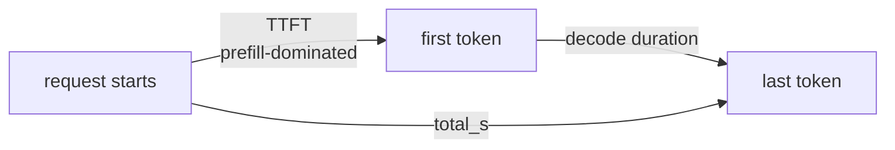

| Field | What nanoserve measures | Question it helps answer |
|---|---|---|
| `prompt_tokens` | Tokens seen by the engine | How much prompt work actually occurred? |
| `output_tokens` | Pieces emitted by the engine | How much sequential decode occurred? |
| `ttft_s` | Start to first emitted piece | How long before a user sees progress? |
| `prefill_tps` | Prompt tokens divided by TTFT | How efficiently is the prompt processed? |
| `decode_tps` | Later generated pieces per second | How quickly does text stream after TTFT? |
| `total_s` | Start through the final generated piece | How long did generation occupy the engine? |
| `wall_s` | Time around the whole benchmark call | Is wrapper overhead material? |

Important boundaries:

- Model construction happens before the sweep timer, so benchmark rows do not
  include model download or load time.
- The first real request can still include kernel compilation and allocator
  warm-up. Treat it separately from steady-state measurements.
- `prompt_tokens_target` is an approximate prompt-size input. Use the measured
  `prompt_tokens` field when interpreting results.
- Three or four repeated generations can show variability; they are not enough
  to support a meaningful p95 latency claim.
- The direct benchmark excludes HTTP, JSON, SSE, queueing, and client network
  time. Those are separate serving measurements.

## How the benchmark loop works

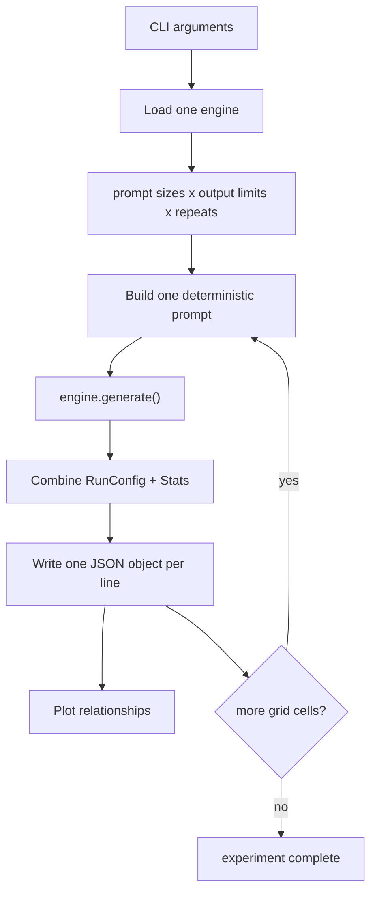

`bench.py` loads the model once and reuses it across the whole grid. This is
the steady-state shape of a server: expensive shared weights remain resident
while requests come and go.

The CLI overwrites its `--out` path. Give each experiment a distinct filename;
the `results/` directory is gitignored so raw measurements remain local unless
you deliberately preserve them elsewhere.

The current built-in plots are best used for one model configuration at a time.
Keep separate JSONL files for Q4, Q8, and BF16 runs; combining labels into one
aggregated comparison is a natural small extension to `plot.py`.

## Run experiments as a learning loop

Do not begin with a giant matrix. Use this loop:

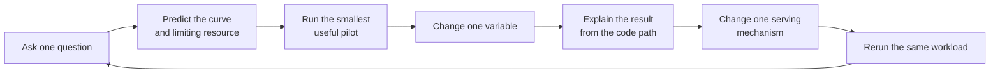

For each experiment, write six lines before moving on:

```text
Question:
Prediction:
Controlled variables:
Result:
Mechanism in the code:
What I would change in a real server:
```

### Recommended curriculum

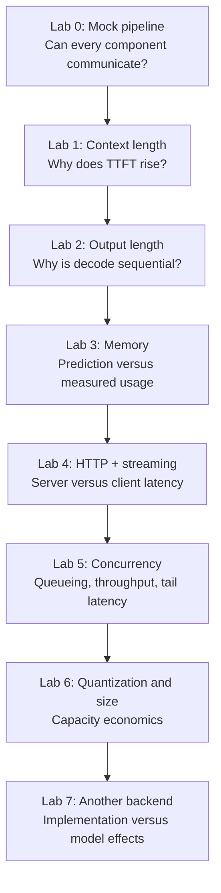

### Lab 1: context length

Hold model, quantization, sampling, and output limit constant:

```bash
python -m nanoserve.bench \
  --engine mlx \
  --model weights/mlx-community__Qwen3-14B-4bit \
  --prompt-tokens 128 1024 4096 8192 \
  --max-tokens 128 \
  --temperature 0 \
  --repeats 4 \
  --label qwen3-14b-q4-context \
  --out results/qwen3-14b-q4-context.jsonl
```

Predict before running:

- TTFT should rise strongly because prefill processes more prompt tokens.
- KV-cache memory should rise linearly with context.
- Decode speed may fall as attention reads a larger cache.

Start with 8K. Add 16K and 32K only after the pilot behaves as expected.

### Lab 2: output length

Hold the prompt constant and change the decode budget:

```bash
python -m nanoserve.bench \
  --engine mlx \
  --model weights/mlx-community__Qwen3-14B-4bit \
  --prompt-tokens 1024 \
  --max-tokens 32 128 512 \
  --temperature 0 \
  --repeats 4 \
  --label qwen3-14b-q4-output \
  --out results/qwen3-14b-q4-output.jsonl
```

`max_tokens` is a limit, not a guarantee. Always check `output_tokens`; an EOS
token can end a response early.

### Lab 3: predicted versus actual memory

Use `memory.py` to predict weight and KV sizes, then add MLX active, cache, and
peak-memory measurements to the benchmark. The discrepancy is the lesson: it
reveals runtime buffers, allocator caching, and what the back-of-the-envelope
formula intentionally omits.

### Lab 4: server and streaming

Measure the same prompt three ways:

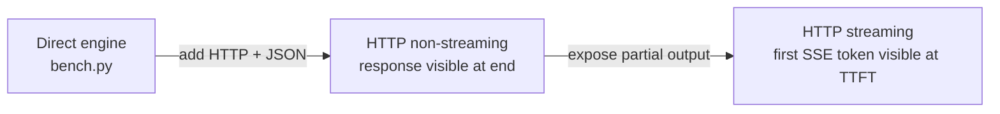

Record server-side TTFT and client-observed TTFT separately. The gap is serving
overhead rather than model execution.

### Lab 5: concurrency—the boundary of the current system

The current server stores one engine and only the most recent request's stats.
It does not yet expose a queue, continuous batching, per-request histories, or
load-test metrics.

That makes concurrency the highest-value next implementation exercise:

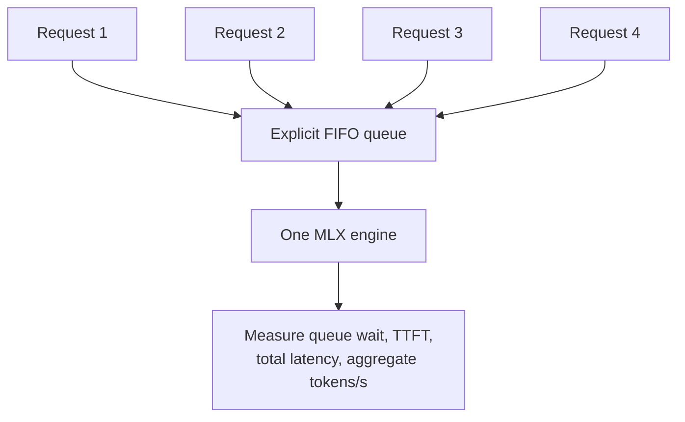

First make serialization explicit and observe head-of-line blocking. Then add
one mechanism—microbatching or shared-prefix caching—and run the identical load
again. This before-and-after experiment teaches more about serving than a large
model leaderboard.

### Lab 6: quantization and model size

Only compare quality after creating a fixed quality evaluation set. A single
summary prompt can measure speed but cannot establish that BF16 is "better" or
Q4 is "good enough."

For performance, hold these constant across checkpoints:

- Model family and architecture.
- Prompt text and measured token count.
- Output limit, temperature, and thinking mode.
- Machine power state and competing workloads.
- Warm-up and repetition policy.

### Lab 7: another engine

Put llama.cpp behind the same `BaseEngine` interface. Keep the model,
quantization, prompt, and output fixed. Any remaining difference now points to
the serving implementation: kernels, cache layout, sampling loop, or scheduler.

## Current capability boundary

```mermaid
flowchart LR
    subgraph NOW["Implemented now"]
        A["Mock + MLX engines"]
        B["OpenAI-style chat endpoint"]
        C["SSE streaming"]
        D["Single-request timing"]
        E["Memory estimator"]
        F["JSONL sweeps + basic plots"]
    end

    subgraph NEXT["Learning exercises, not current claims"]
        G["Warm-up-aware aggregation"]
        H["Measured MLX memory"]
        I["Client load generator"]
        J["Queue and per-request metrics"]
        K["Batching or prefix caching"]
        L["Quality evaluation"]
        M["llama.cpp backend"]
    end

    NOW --> NEXT
```

Keeping this boundary clear matters. A server that returns tokens is the core
of serving, but inference engineering also includes scheduling, overload,
tail latency, memory pressure, observability, and reliability.

## Configuration without magic

All server settings come from `NANOSERVE_*` environment variables:

| Variable | Default | Purpose |
|---|---|---|
| `NANOSERVE_ENGINE` | `auto` | Choose `mock`, `mlx`, or auto-detect MLX |
| `NANOSERVE_MODEL` | Local Qwen3 Q4 if present | Model repository or local path |
| `NANOSERVE_HOST` | `127.0.0.1` | Bind address |
| `NANOSERVE_PORT` | `8000` | HTTP port |
| `NANOSERVE_MAX_TOKENS` | `256` | Default output ceiling |
| `NANOSERVE_TEMPERATURE` | `0.7` | Default sampling temperature |
| `NANOSERVE_THINKING` | `false` | Enable Qwen3 reasoning output |

Requests may override `max_tokens` and `temperature`. The model field is
accepted for OpenAI API compatibility, but the loaded server engine owns the
actual model.

## Common surprises

### The first real request is much slower

The model may be resident, but kernels and allocator caches can still warm up.
Separate cold-start, first-request, and steady-state measurements.

### The requested prompt size and measured prompt size differ

`bench.py` constructs approximately the requested number of words, then the
model's tokenizer decides the actual token count. Analyze `prompt_tokens`, not
only `prompt_tokens_target`.

### A response contains fewer tokens than `max_tokens`

The model emitted EOS. `max_tokens` is a safety ceiling. Use the measured output
count when calculating or comparing work.

### The process fits by formula but macOS shows pressure

The calculator intentionally omits runtime overhead. Reduce context or use a
smaller quantization, and leave headroom for the operating system.

### `auto` chooses the mock engine

MLX-LM is not importable in the active environment. On Apple Silicon:

```bash
pip install -e ".[mac,viz,dev]"
```

### Port 8000 is already occupied

```bash
NANOSERVE_PORT=8001 python -m nanoserve.server
```

### The charts look authoritative but came from `MockEngine`

Mock data validates the measurement and plotting pipeline only. Put the engine
and model in chart titles or filenames so simulated and physical results cannot
be confused.

## Use the interactive explorer

Two companions live in `education/visualizations/`:

- [`tour.html`](visualizations/tour.html) — this guide as rooms, analogies, and
  interactive exhibits (one stove, a growing stack of notes, a hallway).
- [`index.html`](visualizations/index.html) — a live simulation of one request
  through memory and bandwidth.

```bash
open education/visualizations/tour.html
open education/visualizations/index.html
```

Their speeds are illustrative. Use `bench.py` for measurements of this machine.

## A newcomer is finished when they can explain this

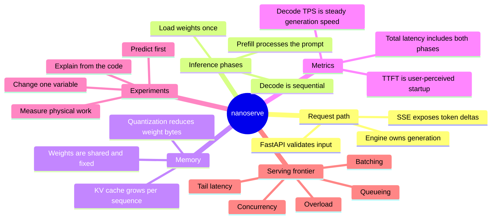

If you can trace one request through the code, predict how context changes TTFT
and KV memory, and explain why concurrent requests require scheduling, then you
are no longer merely running a local model—you are learning serving engineering.

## Where to go next

- Use [`experiments.md`](experiments.md) as the experiment backlog.
- Use [`README.md`](../README.md) as the compact command reference.
- Read [`nanoserve/engine.py`](../nanoserve/engine.py) to understand the hot path.
- Read [`tests/test_server.py`](../tests/test_server.py) to see the API contract.
- Build warm-up-aware aggregation before publishing benchmark comparisons.
- Build the concurrency lab before adding production-style infrastructure.
